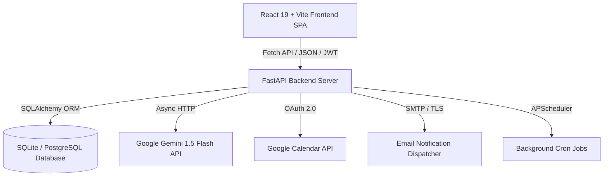

# 🏥 SwasthyaCare AI — Telemedicine & Smart Doctor Appointment Platform 🇮🇳

[](https://healthappointment-ecru.vercel.app)
[](https://fastapi.tiangolo.com)
[](https://react.dev)
[](https://vitejs.dev)
[](https://python.org)
[](https://ai.google.dev/)

Welcome to **SwasthyaCare AI**! An open-source, full-stack healthcare platform inspired by the **Ayushman Bharat Digital Mission (ABDM)**. It combines modern telemedicine workflows, AI-assisted symptom triage, OPD slot scheduling, prescription management, and doctor leave handling into a clean, unified experience.

---

## 🌐 Live Application

- **Live URL**: [https://healthappointment-ecru.vercel.app](https://healthappointment-ecru.vercel.app)
- **Interactive API Docs (Swagger UI)**: [https://healthappointment-ecru.vercel.app/api/docs](https://healthappointment-ecru.vercel.app/api/docs)
- **Alternative ReDoc**: [https://healthappointment-ecru.vercel.app/api/redoc](https://healthappointment-ecru.vercel.app/api/redoc)

---

## ✨ What makes SwasthyaCare AI special?

### 1. 🤖 AI-Powered Clinical Triage & Summaries
- **Instant Symptom Analysis**: Patients can describe their symptoms in English or Hindi. Powered by **Google Gemini** (with an emergency rule-engine fallback), the platform evaluates urgency levels (`Low`, `Medium`, `High`, `Emergency`) and immediately recommends matching medical specialists.
- **Pre-Visit Briefings**: Doctors receive AI-generated symptom summaries with suggested questions before the patient even steps into the consultation.
- **Post-Visit Patient Care Plans**: Converts complex doctor clinical notes and prescriptions into simple, actionable daily schedules for patients.

### 2. 🗓️ Smart Doctor Scheduling & Concurrency Protection
- **No Double-Booking**: Strict database-level uniqueness constraints ensure two patients can never book the same doctor at the same time.
- **10-Minute Slot Holds**: While a patient is selecting and reviewing a slot, it is temporarily locked so nobody else takes it.
- **Doctor Leave Conflict Resolution**: If a doctor requests leave on an active day, existing consultations are flagged, patients are alerted, and slots are automatically adjusted.

### 3. 👥 Portals Built for Everyone
- **Patient Portal**: ABHA health ID linking, symptom checker, doctor directory with OPD live badges, 1-click booking, prescription history, and `.ics` calendar exports.
- **Doctor Command Center**: Daily appointments timeline, patient history lookup, prescription writer, clinical notes recorder, and leave scheduler.
- **Admin Dashboard**: Real-time hospital metrics, specialist capacity tracking, revenue estimation (₹), and system notification retry logs.

### 4. 🔐 Flexible Authentication & ABHA Integration
- **JWT Bearer Auth**: Secure, role-based tokens (`patient`, `doctor`, `admin`).
- **Google OAuth 2.0 / Sign-In**: Integrated with Google Identity Services SDK for 1-click sign up & login.
- **ABHA Health ID Support**: Designed to align with Indian digital health records standards.

---

## 🏗️ Architecture & Tech Stack



- **Frontend**: React 19, Vite, Lucide Icons, Vanilla CSS3 Custom Design System (mobile responsive).
- **Backend**: Python 3.10+, FastAPI (ASGI), SQLAlchemy 2.0, Pydantic v2.
- **Security**: Passlib (Bcrypt), Python-Jose (JWT), Google Identity Verification.
- **AI & Integrations**: Google Generative AI (Gemini Flash), Google Calendar API, iCalendar (`.ics`) generation.
- **Deployment**: Vercel Serverless (Python ASGI + Static CDN).

---

## ⚡ Getting Started Locally

### Prerequisites
- Python 3.10 or higher
- Node.js 18+ & npm
- Git

### 1. Clone the repository
```bash
git clone https://github.com/kartik10916/HEALTH.git
cd HEALTH
```

### 2. Set up Backend (Python & FastAPI)
```bash
# Create and activate a virtual environment
python -m venv venv
# On Windows:
venv\Scripts\activate
# On Linux/macOS:
source venv/bin/activate

# Install dependencies
pip install -r requirements.txt
```

### 3. Configure Environment Variables
Create a `.env` file in the project root:
```bash
cp .env.example .env
```

Here's what each setting does:

| Variable | Description | Default / Example |
|---|---|---|
| `SECRET_KEY` | Key used to sign JWT tokens | `supersecret-healthcare-jwt-key` |
| `ALGORITHM` | JWT signing algorithm | `HS256` |
| `ACCESS_TOKEN_EXPIRE_MINUTES` | Session token duration | `480` (8 hours) |
| `DATABASE_URL` | SQLite / PostgreSQL URI | `sqlite:///./healthcare.db` |
| `GEMINI_API_KEY` | *(Optional)* Google Gemini Key for AI Triage | `AIzaSy...` (Falls back to rule engine if empty) |
| `GOOGLE_CLIENT_ID` | *(Optional)* Google Cloud OAuth Client ID | `xxxx.apps.googleusercontent.com` |
| `SMTP_HOST` / `SMTP_USER` | *(Optional)* Gmail / SMTP for email alerts | `smtp.gmail.com` |

### 4. Seed the Database with Demo Doctors & Patients
Run the included seed script to populate sample AIIMS & Indian specialist profiles, patients, and initial OPD schedules:
```bash
python seed_admin.py
```

### 5. Start the Development Servers

**Option A — Run Fullstack via FastAPI (recommended for local test):**
```bash
# Build frontend once
cd frontend && npm install && npm run build && cd ..

# Start FastAPI server
uvicorn main:app --reload --host 127.0.0.1 --port 8000
```
Open **`http://127.0.0.1:8000`** in your browser!

**Option B — Run with Vite Hot Reload (for frontend development):**
```bash
# Terminal 1: Backend
uvicorn main:app --reload --port 8000

# Terminal 2: Frontend
cd frontend
npm install
npm run dev
```
Open **`http://localhost:5173`** (Vite will proxy all `/api` requests to port 8000).

---

## 🔑 Pre-seeded Demo Accounts

You can test every role immediately using these sample credentials:

| Role | Email | Password | What you can test |
|---|---|---|---|
| 👑 **Administrator** | `admin@swasthya.in` | `Admin@123` | Hospital stats, revenue overview (₹), active doctor capacity |
| 🩺 **Doctor (Cardiologist)** | `dr.sharma@swasthya.in` | `Doctor@123` | Consultation queue, prescription writing, leave management |
| 🩺 **Doctor (General OPD)** | `dr.swaminathan@swasthya.in` | `Doctor@123` | Fever/triage cases, patient summaries, schedule slots |
| 🧑‍🦰 **Patient** | `rahul@example.com` | `Patient@123` | ABHA profile (`14-8765-4321-9012`), AI symptom check, booking |
| 👩‍🦱 **Patient** | `kavita@example.com` | `Patient@123` | Booking specialists, downloading `.ics` calendar events |

---

## ☁️ Deploying to Vercel (Step-by-Step)

This repository is pre-configured with `vercel.json` for one-click fullstack serverless deployment.

1. **Push your code to GitHub**:
   ```bash
   git push origin main
   ```
2. **Deploy with Vercel CLI**:
   ```bash
   npx vercel --prod
   ```
3. **Set Environment Variables in Vercel**:
   Go to your **Vercel Project Dashboard** > **Settings** > **Environment Variables** and add:
   - `SECRET_KEY` = your strong random string
   - `ALGORITHM` = `HS256`
   - `ACCESS_TOKEN_EXPIRE_MINUTES` = `480`
   - `GEMINI_API_KEY` = *(Optional)* your Gemini API key
   - `GOOGLE_CLIENT_ID` = *(Optional)* your Google OAuth client ID

---

## 🔐 Setting up Google Sign-In (OAuth 2.0)

To let patients and doctors log in with Google on your live domain:

1. Go to **[Google Cloud Console](https://console.cloud.google.com/apis/credentials)**.
2. Under **OAuth consent screen**, select **External**, enter your app name (`SwasthyaCare AI`), and add `vercel.app` to **Authorized domains**.
3. Under **Credentials**, click **+ CREATE CREDENTIALS** > **OAuth client ID** > **Web application**.
4. In **Authorized JavaScript origins**, add your Vercel URL:
   - `https://healthappointment-ecru.vercel.app`
   - `http://localhost:5173` *(for local testing)*
5. In **Authorized redirect URIs**, add:
   - `https://healthappointment-ecru.vercel.app`
   - `https://healthappointment-ecru.vercel.app/api/auth/google`
6. Copy the **Client ID** and set it in Vercel as `GOOGLE_CLIENT_ID`.

---

## 📡 API Overview

| Method | Endpoint | Access | Description |
|---|---|---|---|
| `POST` | `/api/auth/register` | Public | Register new patient or doctor account |
| `POST` | `/api/auth/login` | Public | Login with email and password |
| `POST` | `/api/auth/google` | Public | Google Sign-In credential verification |
| `GET` | `/api/auth/me` | User | Get current logged-in profile |
| `POST` | `/api/patient/triage` | Public / User | AI symptom triage & specialist matching |
| `GET` | `/api/patient/doctors` | Public | Search and filter specialist directory |
| `GET` | `/api/patient/doctors/{id}/slots` | Public | Get real-time available time slots |
| `POST` | `/api/patient/doctors/{id}/hold-slot` | Patient | Lock a slot for 10 minutes |
| `POST` | `/api/patient/appointments` | Patient | Confirm appointment & trigger calendar sync |
| `GET` | `/api/patient/appointments/{id}/ics` | Patient | Download iCalendar `.ics` file |
| `GET` | `/api/doctor/appointments` | Doctor | Doctor's active consultation timeline |
| `PUT` | `/api/doctor/appointments/{id}` | Doctor | Add clinical notes & prescriptions |
| `POST` | `/api/doctor/leaves` | Doctor | Schedule leave & auto-notify affected patients |
| `GET` | `/api/admin/stats` | Admin | Overall analytics, urgency breakdown & revenue |

Interactive Swagger documentation is available at [`/api/docs`](https://healthappointment-ecru.vercel.app/api/docs).

---

## 🤝 Contributing

Contributions are always welcome! Feel free to:
1. Fork the repository
2. Create a feature branch (`git checkout -b feature/AmazingFeature`)
3. Commit your changes (`git commit -m 'Add AmazingFeature'`)
4. Push to the branch (`git push origin feature/AmazingFeature`)
5. Open a Pull Request

---

## 📄 License

Distributed under the **MIT License**. See `LICENSE` for more information.

---

<div align="center">
  <sub>Built with ❤️ for the Digital Health Mission India 🇮🇳</sub>
</div>